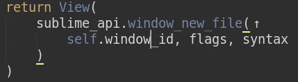

# AutoSplit

AutoSplit is a Sublime Text 3 plugin for automatic splitting arguments across multiple lines and joining them back to one line. Works currently only for Python. Support for other languages is ahead.

AutoSplit assumes that function or method calls can be in 1 of 3 possible forms:

* inline: all the arguments fit on the same line as the opening parenthesis `(`
    ```python
    view_id = sublime_api.window_find_open_file(self.window_id, fname)
    ```

* next line: all the arguments are on the following line, closing parenthesis `)` is on the 3rd line
    ```python
    view_id = sublime_api.window_find_open_file(
        self.window_id, fname
    )
    ```

* multiline: every argument is on a fresh line:
    ```python
    view_id = sublime_api.window_find_open_file(
        self.window_id,
        fname
    )
    ```

## Split/Join commands

AutoSplit provides for (semi-)automatic switching between these argument list forms. All of the command operate on the innermost arglist(s) the cursor(s) is(are) in.


* Split (suggested keybinding: `Alt+]`)

    Push args off the first line (the line of the opening `(`) to the next line. If already at the next line, split them across multiple lines (every arg on its own line).

* Join (suggested keybinding: `Alt+[`)

    Try to join all of the arguments to the next line. If all the arguments are already on the next line, then try to lift them up to the first line.


## Split if too long

If you've got the ruler configured, AutoSplit will automatically split long argument lists (the ones that surpass the ruler).


## Join indicators

Once you've deleted enough of the contents of the arglist so that it's possible to join it up again, there appears a (clickable) arrow indicator. The arrow is implemented as a Sublime phantom so it's not a part of your text. The arrow just says "it's possible to join the current arglist up".




An up arrow says "possible to join to the first line", a left arrow says "possible to join to the next line".

You can turn on/off arrow indication with the setting named `show_arrows`.


## Multiline tails

The last nested argument list can actually span multiple lines, whereas an initial part of it still resides at the same line as the parent's opening parenthesis:

```python
    def new_file(self, flags=0, syntax=""):
        """ flags must be either 0 or TRANSIENT """
        return View(sublime_api.window_new_file(self.window_id, flags, get_syntax(
            nested_call_1(arg1),
            nested_call_2(arg2),
            nested_call_3(arg3)
        )))
```

We refer to such argument lists as "multiline tails" of their parents. In this example, `get_syntax` is a multiline tail of `window_new_file` call.  AutoSplit has special support for multiline tails:

* splitting an arglist with a multiline tail correctly adjusts indentation inside the tail

    ```python
        def new_file(self, flags=0, syntax=""):
            """ flags must be either 0 or TRANSIENT """
            return View(
                sublime_api.window_new_file(
                    self.window_id, flags, get_syntax(
                        nested_call_1(arg1),
                        nested_call_2(arg2),
                        nested_call_3(arg3)
                    )
                )
            )
    ```
    Accordingly, joining an arglist with a multiline tail dedents the tail back.

* if it's only possible to join an arglist with a multiline tail, this is indicated with dashed up and left arrows:

    

    In this example, it's not possible to fully join the arglist up to one line. But it's possible to join it partially, that is, leaving the multiline tail unjoined. Thich is indicated by the dashed arrows.


## Keybindings

The 2 commands `autosplit_split` and `autosplit_join` is best to use with keybindings, such as `Alt+[` or `Alt+]` or any other you like. For suggested key bindings, please choose the `Preferences -> AutoSplit -> Example Key Bindings` menu.