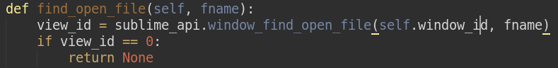
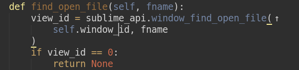
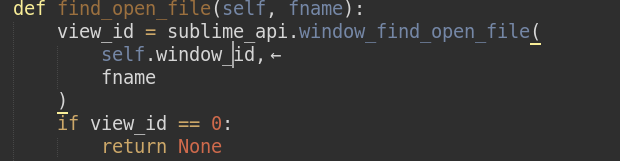

# AutoSplit

AutoSplit is a Sublime Text 3 plugin for automatic splitting arguments across multiple lines and joining them back to 1 line, currently only for Python. Support for other languages is ahead.

AutoSplit assumes that Python function or method calls can be in 1 of 3 possible forms:

* inline: all the arguments fit on the same line as the opening parenthesis `(`
    ```python
    root_processor.enqueue('mytask', [], options=None)
    ```

* next line: all the arguments are on the following line, closing parenthesis `)` is on the 3rd line
    ```python
    root_processor.enqueue(
        'mytask', [], options=None
    )
    ```

* multiline: every argument is on a fresh line:
    ```python
    root_processor.enqueue(
        'mytask',
        [],
        options=None
    )
    ```

AutoSplit provides for (semi-)automatic switching between these forms:


* Split (default keybinding: `Alt+]`)

Push args off the first line (the line of the opening `(`) to the next line. If already at the next line, split them across multiple lines (every arg on its own line).

* Join (default keybinding: `Alt+[`)

Try to join all of the arguments to the next line. If all the arguments are already on the next line, then try to lift them up to the first line.





